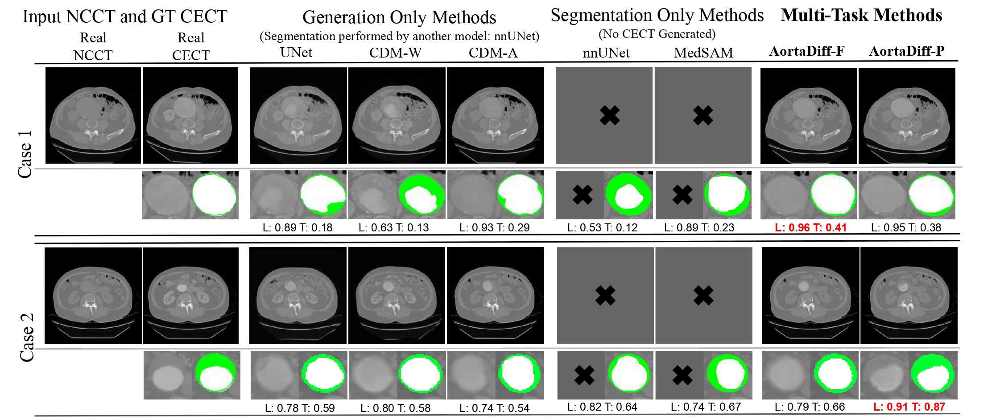

# 🫀 AortaDiff: A Unified Multitask Diffusion Framework For Contrast-Free AAA Imaging



AortaDiff is a multitask diffusion framework for simultaneous NCCT→CECT translation and lumen/thrombus segmentation. Unlike prior multitask diffusion methods, AortaDiff requires no auxiliary predictions (e.g., coarse masks), shares both encoder and decoder parameters across tasks, and supports semi-supervised learning to handle missing segmentation labels—an important challenge in clinical datasets.
Evaluated on 264 patients, AortaDiff consistently outperforms state-of-the-art single-task and multi-stage baselines. For image synthesis, it reaches 25.61 dB PSNR (vs. 23.80 dB from a single-task CDM). For segmentation, it improves lumen Dice to 0.89 (from 0.87) and thrombus Dice to 0.53 (from 0.48 with nnU-Net). These gains translate to more accurate clinical measurements, reducing lumen diameter MAE from 5.78 mm to 4.19 mm and thrombus area error from 41.45\% to 33.85\%.


## 📦 Usage

### 1️⃣ Data Preparation

Prepare the dataset following these requirements:

#### ✔ Normalize images
Normalize **noncontrast** and **contrast** CT images to the range **[-1, 1]**.

#### ✔ Consistent pairing
If noncontrast and contrast belong to the same case,  
they must share the **same filename**.

#### ✔ Required masks
Prepare the following masks:

| Filename | Description |
|----------|-------------|
| `contrast` | Contrast CT image |
| `noncontrast` | Noncontrast CT image |
| `noncontrastmask` | Aorta mask for noncontrast CT image |
| `contrastaortamask` | Aorta mask for contrast CT image |
| `contrastlumenmask` | Lumen mask for contrast CT image |

Place *all images and masks in the **same directory***.

#### ✔ Prepare dataset split
Generate the following `.npy` files containing identifiers for training, validation and testing split: 
train_list.npy
val_list.npy
test_list.npy

---

### 2️⃣ Create Conda Environment

```bash
conda env create -f environment.yml
```
### 3️⃣ Train the AortaDiff-P Model
```bash
conda activate AortaDiff
cd AortaDiff

python train.py \
    --train_data_dir /path/to/train/data \
    --val_data_dir /path/to/val/data \
    --experiment_name my_experiment \
    --model_name unet or diffusion \
    --filter_train /path/to/train_list.npy \
    --filter_partial /path/to/val_list.npy \
    --sdg_lumen_mask \
    --add_mask_mse_loss \
    --use_kendall_loss

```

You may edit hyperparameters (iterations, batch size, validation frequency, etc.) in: configs/brats_configs.py


### 4️⃣ Sampling
Use the trained model to generate reconstructed outputs:
```bash
python sample.py \
    --data_dir /path/to/test/data \
    --experiment_name_forward my_experiment \
    --modelfilename checkpoint_name.pt \
    --filter /path/to/test_list.npy \
    --sdg_lumen_mask
```

### Acknowledgement
This code is based on:  
- [MMCCD](https://github.com/ZiyunLiang/MMCCD)  
- [Guided Diffusion](https://github.com/openai/guided-diffusion/tree/main/guided_diffusion) 
We thank the authors for releasing their code and enabling further research.

## 📖 Paper
If you use this codebase, please cite our work:  

```bibtex
@misc{ou2025aortadiffunifiedmultitaskdiffusion,
      title={AortaDiff: A Unified Multitask Diffusion Framework For Contrast-Free AAA Imaging}, 
      author={Yuxuan Ou and Ning Bi and Jiazhen Pan and Jiancheng Yang and Boliang Yu and Usama Zidan and Regent Lee and Vicente Grau},
      year={2025},
      eprint={2510.01498},
      archivePrefix={arXiv},
      primaryClass={cs.CV},
      url={https://arxiv.org/abs/2510.01498}, 
}
```


